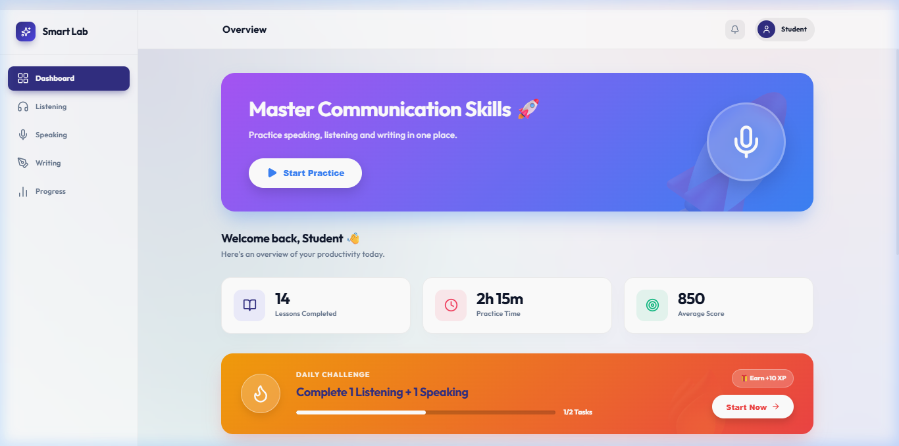
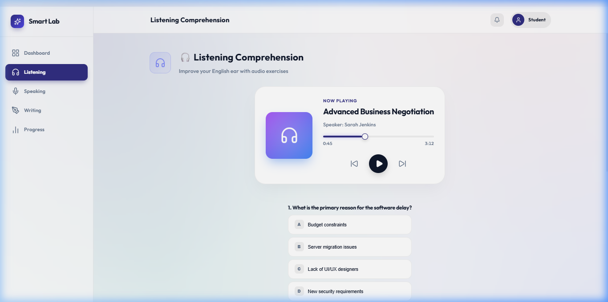
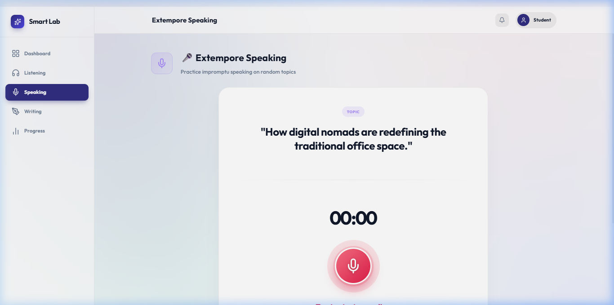
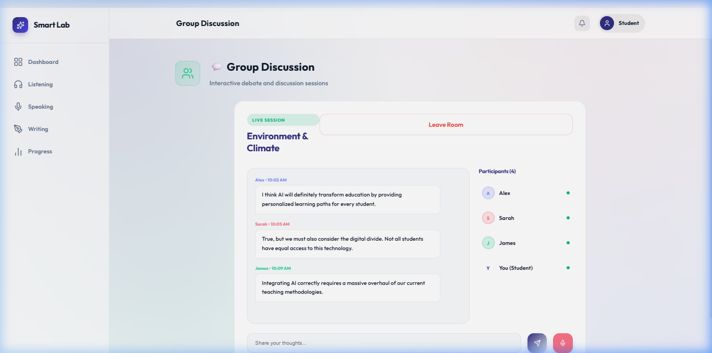

# 🚀 Smart Language Lab

Smart Language Lab is a premium, high-fidelity web application designed to modernize English communication practice. Built for students and language learners, it provides an immersive, interactive experience across multiple learning modules.



## ✨ Features

### 1. **Interactive Dashboard**
- **Productivity Overview**: Track lessons completed, practice time, and scores with real-time visual stats.
- **Hero Section**: A vibrant entry point to quickly resume practice.
- **Daily Challenge Banner**: A high-impact, gamified section with progress tracking and rewards to encourage daily consistency.

### 2. **🎧 Listening Comprehension**
- **Modern Audio Player**: A Spotify-inspired playback interface with real-time scrubbing, album art, and volume controls.
- **Timed Exercises**: Integrated multiple-choice questions linked directly to the audio content.
- **Real-time Feedback**: Instant scoring upon submission.



### 3. **🎤 Extempore Speaking**
- **Live Transcription**: Experience real-time Speech-to-Text as you speak, providing instant visual feedback.
- **Visual Recording States**: Glowing animations and timers that respond to your voice capture.
- **Voice Studio UI**: Professional-grade recording interface designed for focus.



### 4. **💬 Group Discussion Room**
- **Live Discussion Simulator**: Join virtual rooms and participate in simulated real-time debates.
- **Interactive Chat Feed**: View contributions from other participants in a clean, modern messaging interface.
- **Participant Tracking**: See who is active in the room and contribute your perspective via microphone or chat.



### 5. **✍️ Dialogue Writing & Phonetics**
- **Contextual Writing**: Practice real-world scenarios with a dedicated dialogue editor featuring browser-based persistence.
- **AI Voice Lab**: High-fidelity Text-to-Speech powered phonetics lab to master vowel sounds and pronunciation.

## 🛠️ Technology Stack

- **Core**: Vanilla JavaScript (ES6+), HTML5
- **Styling**: Modern CSS3 with Flex/Grid, Glassmorphism, and custom Keyframe Animations
- **Icons**: Lucide Icons
- **APIs**: Web Speech API (Recognition & Synthesis), MediaRecorder API, Web Audio API
- **Build Tool**: Vite

## 🚀 Getting Started

1. **Clone the repository**:
   ```bash
   git clone https://github.com/shaaannn7/Smart-language-lab.git
   ```

2. **Install dependencies**:
   ```bash
   npm install
   ```

3. **Run in development mode**:
   ```bash
   npm run dev
   ```

4. **Open in browser**:
   Navigate to `http://localhost:5173` (or the port specified in your terminal).

## 🎨 Design Philosophy

Smart Language Lab focuses on **Aesthetics + Functionality**. The UI utilizes:
- **Glassmorphism**: Translucent surfaces with background blurs.
- **Dynamic Gradients**: Vibrant, shifting background meshes.
- **Micro-interactions**: Subtle hover lifts, button ripples, and snappy transitions for a premium software feel.

---

*Developed for the Smart Language Learning Initiative.*
